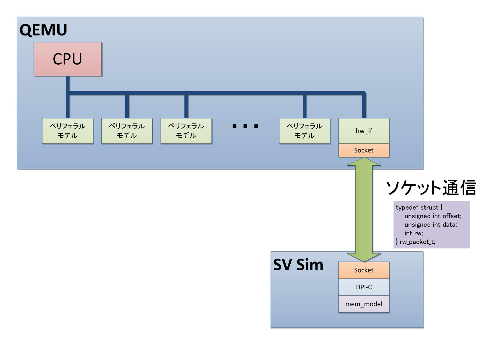

qemu2sv
=======

RTL Simulator(以下SV Sim)とオープンソースのエミュレータであるQEMUを接続し
一緒にシミュレーションをする環境です。  
QEMU側はあらかじめ用意されている「xilinx-zynq-a9」のアーキテクチャに通信用モジュールを組み込みました。
SV Sim側はDPI-Cを用いてQEMUと通信させています。  
通信にはソケット通信を使用しています(IP:127.0.0.1 ポート番号:15785)  

QEMU⇔SV Sim間でサポートしている転送は
シングルWrite/Readのみでバースト転送や割り込みには対応していません。

またQEMU⇔SV Sim間のシミュレーション時間を同期していない為
SV Simから見るとQEMUが0時間で応答している様に見えます。

システム全体は↓の様になっています。


#使い方
##QEMUビルド
1. [http://wiki.qemu.org/Download](http://wiki.qemu.org/Download)から「qemu-2.1.2.tar.bz2」をダウンロード  
2. qemu-2.1.2.tar.bz2を解凍してqemu2sv/qemuフォルダの中身を上書き  (hwとdefault-configsが上書きされます)  
3. 以下コマンドを実行してビルド  
>cd qemu-2.1.2
>mkdir build  
>cd build  
>../configure --target-list="arm-softmmu,microblazeel-softmmu" --enable-fdt --disable-kvm  
>make  

4.`make install`又は`build/arm-softmmu/qemu-system-arm`
     にPathを設定して実行可能状態にします。  
5.`qemu-system-arm -M xilinx-zynq-a9 -nographic`
を実行し待ち受け状態になるか確認します  
(15秒経過でTimeOutします。)
```
>qemu-system-arm -M xilinx-zynq-a9 -nographic
[hw_if] Socket is listening for connections... Please start the rtl simulation.
        Timeout after 15 sec
```
##SV Sim 準備
付属の```qemu2sv/sv/Makefile```はRiviera-PRO、ModelSim用です。

1.qemu2sv/sv/Makefileを編集  
* MODELSIM_HOMEのパスを環境に合わせ修正(sv_dpi.hがあるパスに変更)  
* 64bit環境の場合-m32を-m64に変更する  
    ※ModelSim Altera Starter Editionを使う場合は64bit環境でも-m32にして下さい

2.```make```でシミュレーションを実行できます。  
  実行後```Start server connect...```と表示され、何もしなければ15秒でTimeOutします。

##SV Sim 準備
QEMUが通信待ち受け状態の時にSV Simを実行するとQEMUとSV Simが接続します。  
これで確認は完了です。  
ZynqLinux等を用意しアドレス`0xE0004000`へリードorライトを行うとSV Sim側がログを出力します。
